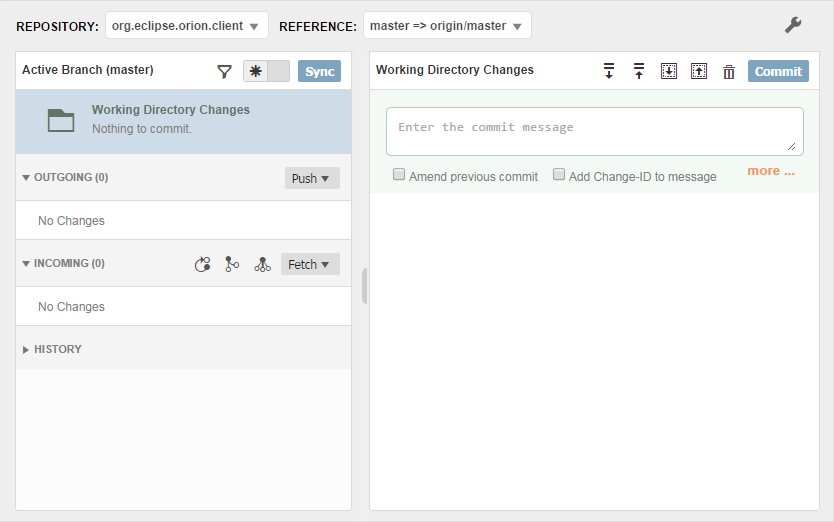
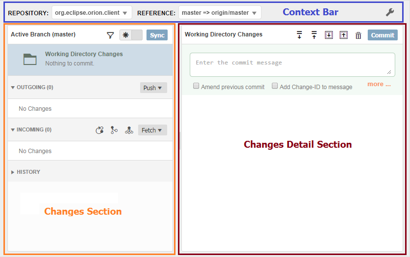
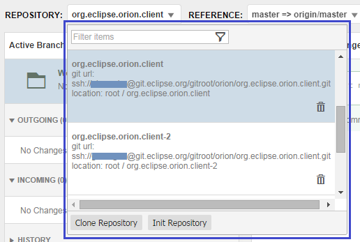

# Caution: draft document

# Overview

The Orion Git page has been designed to offer the most common Git functionality on a single page.This guide will describe the main features of the page along with a step by step guide to  common Git operations.

Fig 1. Git Page in Orion 7.0
# Git Page Structure

The Git page is a selection driven master-detail page. You select a repo, you select a branch (or accept the default branch selected) and, along with your current changes, the page will display the changes for the branch.

The page is made up of 3 main sections - the context bar, the changes section and the changes details section. The 5 second summary for each of these sections:

** [Context Bar](#Context-Bar) **
* used for working with repos and references (branches, tags and stashes)

* set/edit additional git config options

** Changes Section **

* displays info about changes for the chosen repo and reference

* actions for fetching and pushing changes 

** Changes Detail Section **

* displays current working directory changes

* actions for working with working directory changes

* displays the contents of changes for the chosen reference

* actions for working with a particular change

Fig 2. Main sections of git page

## Context Bar

The context bar controls what gets displayed in the changes sections. Let's take a look at what's in each dropdown.

### Repository

The repository dropdown displays all of the git repos that you currently have in your workspace. If you have a number of repos listed, you can make use of the filter field to cut down on scrolling. Simply type in the name you are lookiing for and hit Enter (see Filtering for more info)

The repository dropdown lets you:

* clone a repo

* create a new repo

* select an existing repo (with filter support)

* delete an existing repo

Fig 3. Git repository dropdown menu

#### Clone a New Repo

To clone a new repo, click on the ***Clone Repository*** button.

#### Create a New Repo

You can create a new repo by clicking on the ***Init Repository*** button.

#### Select an Existing Repo

To switch which repo you are working with, simply select another repo listed there. The dropdown will close automatically and the page will refresh to show the new repo.

#### Delete an Existing Repo

To delete an existing repo, click on the trash can next to the repo.

### References

The References section lets you select which references to work with in the page.

The dropdown box for the reference displays the name of your active local branch as well as the name of the reference that is currently being used as a target.

### Config section

## Changes Section

### Top Bar

#### Filter

#### History Toggle

#### Sync Button

### Working Directory Changes

### Outgoing Section

#### Push

### Incoming Section

#### Rebase

#### Merge

#### Squash

#### Reset

#### Fetch

### History Section

#### Commit Details

#### More

## Changes Detail Sections

### Top Bar

#### Stash

#### Patch

#### Discard

#### Commit

### Commit Message Area

#### Ammend

#### Change-Id

#### More

# Common Git Tasks

## General Filtering

Throughout the Git page UI there are several places where you are able to filter results. Just type in your filter term and hit Enter or the filter button to start filtering.
You can tell if results are filtered when the filter icon has a dot next to it.

<pic>

Note that in order to clear the filter, you can just clear the filter field and hit Enter again.

## Cloning a Repo

## Creating a new Repo

## Checking out a Branch

## Creating a new Branch

Follow these steps to create a new branch based on the state of your current local branch.

1. From the Reference dropdown, click on the **New Branch** button.
2. Enter a name, and hit **Submit**.
3. Your new branch will appear under the **_local_ ** dropdown.
4. To check it out, hit the checkout button in the row.

You now have a new local branch! You will notice that you have a pile of outgoing changes. This is because by default a placeholder target branch has been created for you.

Hit **Push** to push your new branch to your remote. 

## Creating a new Branch with multiple Remotes

## Creating a new tracking Branch

## Fetch remote branches

## Viewing the log of a Remote Branch

## Stash

## Patches

## Commit changes

## Fetch changes

## Rebase

## Merge

## Squash

## Sync

## Merge contents of branch back to master

## Rebase contents of branch back to master

## Git filesystem

## Working with Gerrit

The Git page currently allows users to *push* and *fetch* patches from a Gerrit. The following steps assumes that you already have a properly configured Gerrit server running somewhere and you have setup your account properly and can already push patches to Gerrit. 

### Adding a Remote
 
The first thing you need to do is add a Gerrit remote to an existing repo. This can be done from the References dropdown. For the purpose of this example, we will be setting up a remote to allow us to push patches for the Orion client project.

<pic>

### Editing Git Config entry

Next thing to do is to edit your new remote fetch config entry to add the appopriate refspecs for pushing to Gerrit/getting patch sets. To do this:

1. Click on the config wrench - and find your new fetch key (hint: you can use the filter, just type 'fetch' anh hit enter)
2. You need to add the following entries to the fetch key (you can alter the value of the existing key and create a **New Configuration Entry** the same name for the other value).

		+refs/heads/*:refs/remotes/<NAME OF REMOTE>/for/*
		+refs/changes/*:refs/remotes/<NAME OF REMOTE>/changes/*
		

Note that if you know the change id of the patch you are interested in reviewing, you can just enter it instead of *. For example, if you want to take a look at change id 34154, you can enter:

		+refs/changes/54/34154/*refs/remotes/<NAME OF REMOTE>/changes/54/34154/*
		
<pic>

### Fetching Branches and Commits

Once the config entries are set, you can fetch the branches and change sets.

1. Expand the References dropdown and click on the Fetch action.

2. When the action finishes you will be able to see all available change sets and branches.

<pic>

You can also fetch changes from the Incoming section in the Commits area.

<pic>

### Getting changes into Gerrit

We'll now take a look at two sample workflows for getting changes into Gerrit, one for simple changes and one for more complex changes. These are by no means the only way of working with Gerrit but just illustrate two different approaches one can take.

The starting point for both of these workflows is that you have your Gerrit account correctly configured (you can push to Gerrit), and that you have your Gerrit remote configured , with the proper config entries (see above section).

#### Simple Changes

For this workflow, we just want to make a small change on a branch (we will use master in this example).

1. Checkout the branch you want to make the change for (see the section 'Checking Out a Branch')

2. Make the change(s) and test...

3. When the changes are ready to go, enter a commit message and check the  ***'Add Change-ID to message'***

4. From the References dropdown, select the **<REMOTE>/for/<BRANCHNAME>** that you want to push to. For example, if you have named your remote "gerrit" and you your change is meant for the master branch, you would select "gerrit/for/master".

5. When you are ready to push, do a fetch and rebase to make sure you are up to date with the remote branch.
 
6. When you are up to date with the **<REMOTE>/for/<BRANCHNAME>** remote, you can Push. You will get an UP_TO_DATE message.
 
7. Logging into the Gerrit UI, you will be able to see your commit under the My Changes section.

	<pic>

#### Complex Changes

### Updating changes in Gerrit

You can update a new version of a Gerrit patch - you just need to know the patch number:

1. Type in the number in the References dropdown filter. If the change doesn't show up under your Gerrit remote, you might need to do a fetch (or check that your number is correct).

2. Select the patch revision you want (if there are more than 1) and click checkout to check it out as a local branch.

3. Make your changes and when you are ready to push, select your files, check the "Amend Previous Commit" box and hit Commit.

4. Switch to the for/ branch you are targeting and hit push.

5. You should now be able to see your patch changes in the Gerrit UI.

### Reviewing changes from Gerrit

Given that you have a Gerrit patch number, you are able to inspect the patch within Orion. To do this:

1. First update your Gerrit remote. From the Reference dropdown, click on the fetch next to the remote.

	<pic>

2. Type the patch number into the filter box. You should see something like: 

		<REMOTE>/changes/<some number>/<patch number>/<revision number>

3. Depending on the number of revisions that have been submitted, you might have more than one entry listed. You are free to inspect any version.

4. Make sure that you have the appropriate local branch checked out. For example, if the Gerrit patch is intended for master, make sure you have master checkout as your local branch.

5. The patch will appear as an incoming change. You can then do a rebase/merge into your master branch to run it etc.

	<pic>

6. To get rid ot the patch, you can just reset your branch to the previous entry in the history, by selecting it and clicking on the Reset button in the Changes detail section.
	
	<pic>

		
		     

